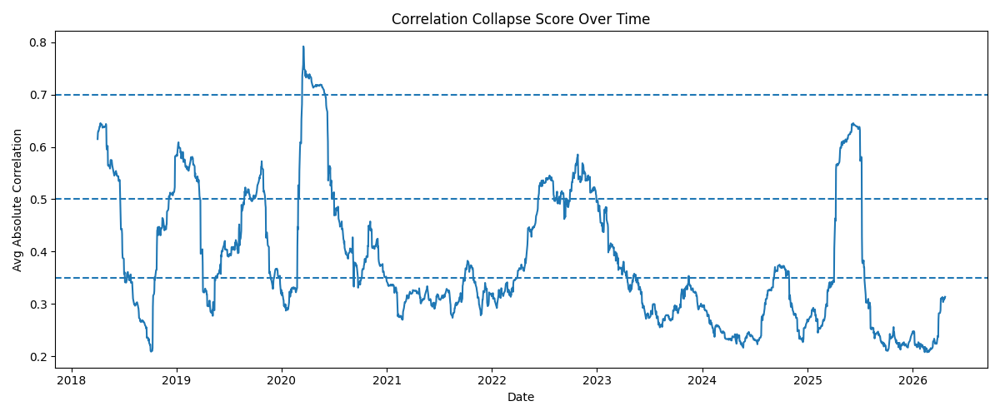
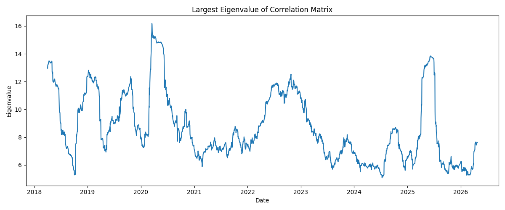
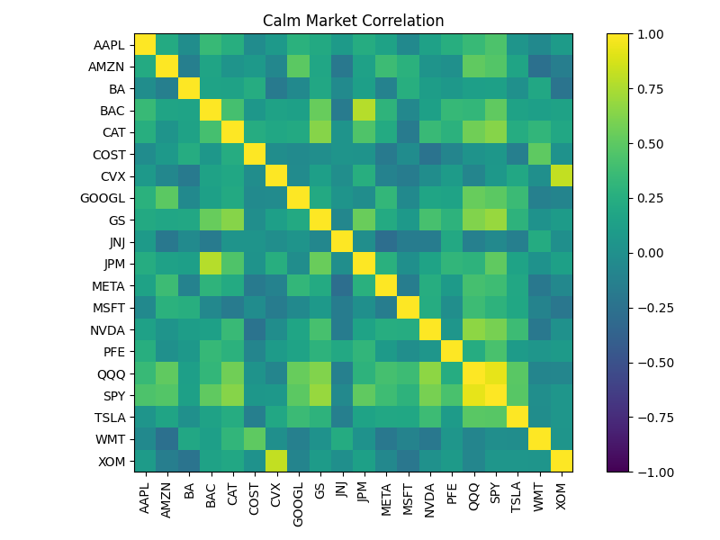
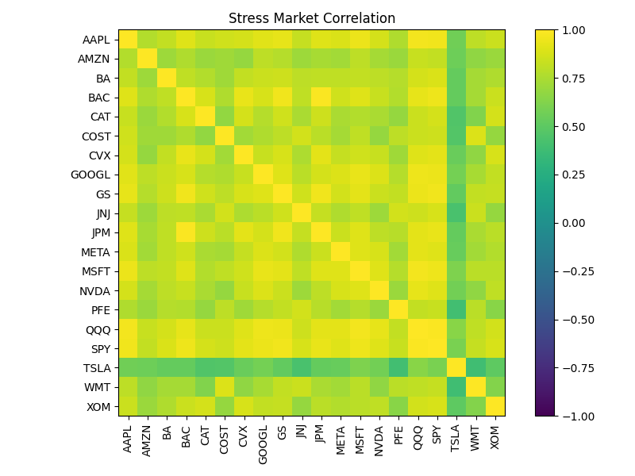
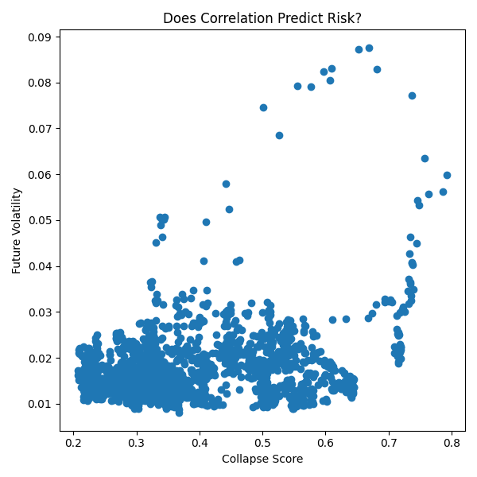

# Systemic Risk & Correlation Collapse Analysis

I built this project to analyze how cross-asset correlation structure evolves over time and what it reveals about systemic risk and market regimes.

## Approach

- Computed log returns for a diversified basket of equities and ETFs  
- Constructed rolling 60-day correlation matrices  
- Defined a **collapse score** as the average absolute correlation (excluding the diagonal)  
- Used eigenvalue decomposition to quantify the dominance of the first principal component (market factor)  
- Compared correlation regimes to forward realized volatility  

## Results

### Correlation Collapse Over Time

### Largest Eigenvalue (Market Factor Strength)

### Calm vs Stress Regimes
| Calm Market | Stress Market |
|------------|--------------|
|  |  |

### Does Correlation Predict Risk?

## Takeaways

- Correlations increase sharply during stress periods (collapse score rising from ~0.35 to ~0.70), reducing diversification  
- The largest eigenvalue rises during these regimes, indicating increasing factor concentration  
- Higher correlation levels tend to precede higher realized volatility  

This suggests that correlation structure contains forward-looking information and can serve as an early indicator of systemic risk.
